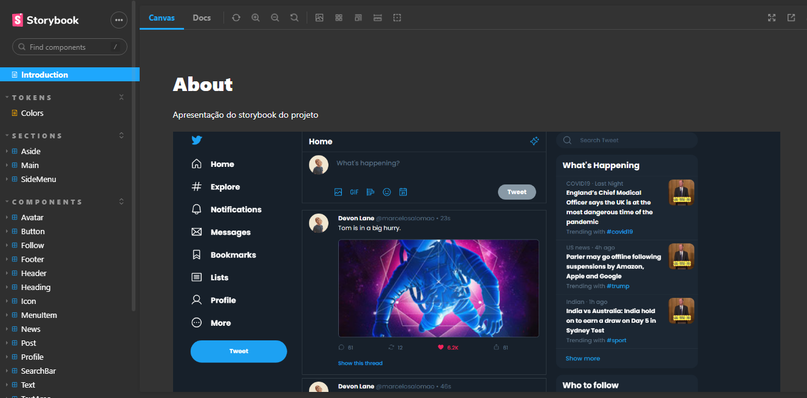

<h1 align='center'>
    

   <p align="center">
      
      
      
      
  </p>  
</h1>

  <p align="center">
  <a href="#-keepalive"> Projeto</a>&nbsp;&nbsp;|&nbsp;&nbsp;
  <a href="#-Tecnologias"> Tecnologias</a>&nbsp;&nbsp;|&nbsp;&nbsp;
  <a href="#-Requisitos-funcionais">  Requisitos  </a>&nbsp;&nbsp;|&nbsp;&nbsp;
  <a href="#-Como-rodar-a-aplicação">  Como rodar  </a>&nbsp;&nbsp;
</p>

<div align='center'>
    
</div>


<div align='center'>
    
</div>


## 🕊 Twitter Storybook

**Twitter Storybook** é o projeto da **5ª Sprint** e o **Desafio 5** do programa de bolsas da Compass Uol. O objetivo é construir um **storybook** e **aplicação** conforme o Twitter.

### ✒ **Layout**
- Para mais informações sobre o Layout acesse o Storybook da aplicação.

[](https://www.figma.com/file/DqSemG9Z09LG9cAf8L8nUm/keepalive)

## 👩‍💻 Tecnologias


### 📔 Bibliotecas

| lib   | desc.       |
| :---------- | :--------- |
| [Storybook](https://storybook.js.org/) | Documentação do Design System do projeto e criação de componentes | 
| [React-Router-DOM](https://v5.reactrouter.com/web/guides/quick-start) |  Navegação entre as páginas | 
| [Moment](https://momentjs.com/) | Para validação dos horários das postagens | 
| [Yup](https://github.com/jquense/yup) | Validação do formulários na página de Login e Registro | 

## 📝 Requisitos funcionais

### ✔ Funcionalidades

- [X] Telas
  - [X] Home
  - [X] Página 404
  - [X] Login
  - [X] Sign Up
- [X] Dark-Mode
- [X] Post dos Tweets
- [X] Post dos Comentários
- [X] Autenticação com Firebase
- [X] Login Social

### 📱 Responsividade  

- [X] Mobile
- [X] Tablet
- [X] Laptop
- [X] Desktop

## 👷‍♀️ Como rodar a aplicação

```bash
# Clone o projeto
$ git clone https://github.com/pedrovinhas/twitter-storybook.git

# Baixe as dependências
$ npm install

# Para rodar a aplicação
$ npm run dev

$ Para rodar a documentação do Storybook
$ npm run storybook
```

---
<blockquote> Feito por Pedro Henrique Vinhas 🪐 </blockquote>
