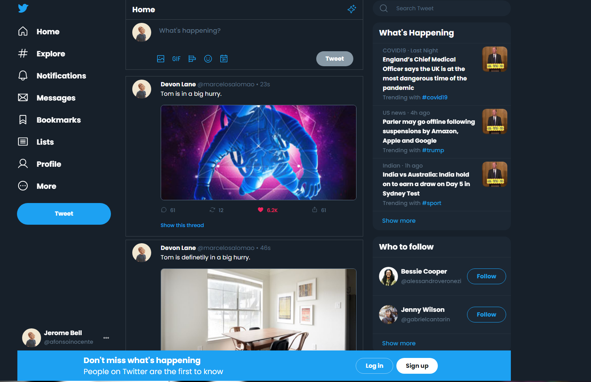

<div align='center'>
    
</div>


<p align="center">
  <a href="#-keepalive">🕊 Projeto</a>&nbsp;&nbsp;|&nbsp;&nbsp;
  <a href="#-Tecnologias"> 👩‍💻 Tecnologias</a>&nbsp;&nbsp;|&nbsp;&nbsp;
  <a href="#-Requisitos-funcionais">  📝 Requisitos  </a>&nbsp;&nbsp;|&nbsp;&nbsp;
  <a href="#-Como-rodar-a-aplicação">  👷‍♀️ Como rodar  </a>&nbsp;&nbsp;
</p>

## 🕊 Twitter Storybook
**Twitter Storybook** é o projeto da **5ª Sprint** e o **Desafio 5** do programa de bolsas da Compass Uol. O objetivo é construir um **storybook** e **aplicação** conforme o Twitter.
### ✒ **Layout**

[](https://www.figma.com/file/DqSemG9Z09LG9cAf8L8nUm/keepalive)


## 👩‍💻 Tecnologias


### 📔 Bibliotecas

- React-Router-DOM
- Date-fns
- Storybook


 ## 📝 Requisitos funcionais

### ✔ Requisitos Principais

- [X] Telas
  - [X] Home
  - [X] Página 404
- [X] Dark-Mode
- [X] Post dos Tweets


### 📱 Responsividade  
- [X] Mobile
- [X] Tablet
- [X] Laptop
- [X] Desktop

## 👷‍♀️ Como rodar a aplicação

```bash
# Clone o projeto
$ git clone https://github.com/pedrovinhas/twitter-storybook.git

# Baixe as dependências
$ npm install

# Rode a aplicação
$ npm run dev
```

---
<blockquote> Feito por Pedro Henrique Vinhas 🪐 </blockquote>